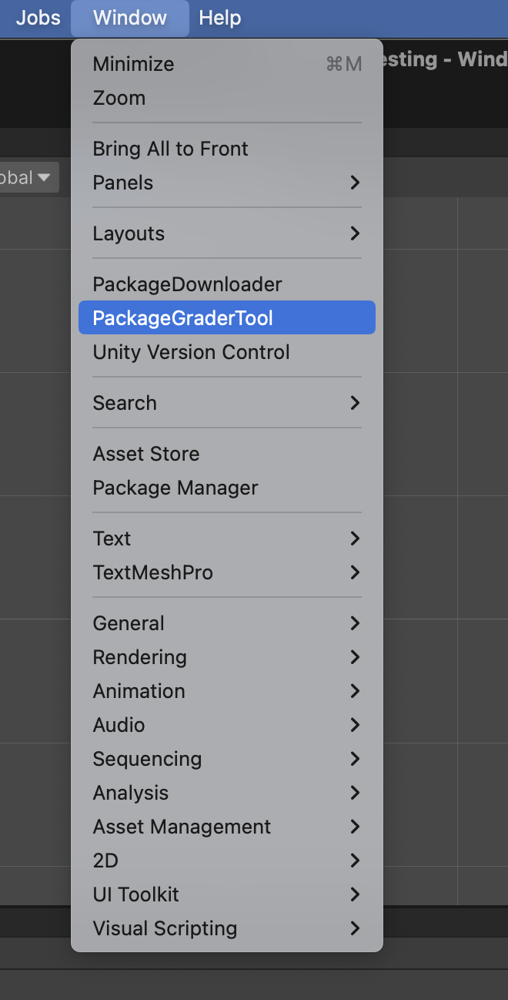

# SI Package Grader and Downloader

Designed to speed up the process of grading `.unitypackage` files for GLSI

This project contains a full unity project, but only files in the `Editor` folder and the `Newtonsoft JSON` package are needed for it to run. These could be packaged together into a `.unitpackage` file.

## To Use

The editor application adds two new editor windows:

The `PackageDownloader` and `PackageGraderTool`

### Package Downloader

The package downloader is capable of downloading multiple `.unitypackage` files from a Google sheets.

In the *Document Id* field, type the ID of the google sheets you're trying to download from. The id is found in the URL to the document. For example, the URL:

`https://docs.google.com/spreadsheets/d/1sFZC1w_Y2sxCrRGlMwVX5L4-_aOUr6B81-R_dPeGgdc/edit#gid=18284558`

has the id `1sFZC1w_Y2sxCrRGlMwVX5L4-_aOUr6B81-R_dPeGgdc`

In the *Page Name* field, type the name of the specific page you're reading from (since Google Sheets can have multiple pages).

Click *Get Sheet Data* to get all the information from the sheet.

After this is done you can start applying filters. Filters qualifiers that limit the amount of projects you download. They are created by clicking the `NEW FILTER` button. After which you'll choose what data you want to filter by (ex. Name, Day number, group color), and then putting in the value you want (ex. Group Color with Value="Blue").

After applying filters you can hit "Apply Filter" to see how many matches you find.

Finally, you can choose the data that will be used to NAME the unity package files. After which, you can hit `Download Matches`

### Package Grader:
- Put all of your `.unitypackage` files into one folder.
- Go to Window > Package Grader, which will prompt a folder selection. Select the folder with all of your `.unitypackage` files.
- For any package on the left of the window you can then: Import > Open a Scene > Delete
- If you want to open a specific scene in the project, you can usie the `Open nth Scene in Package Button`
